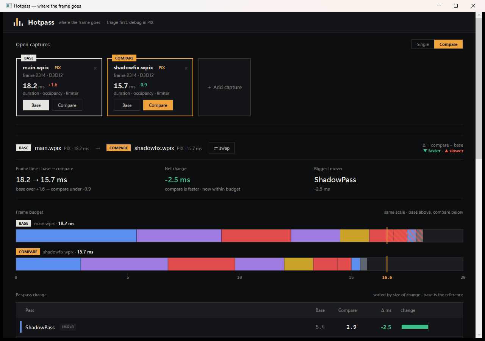

# Hotpass

**GPU ボトルネック簡易トリアージツール**(D3D12 向け)

「フレームのどこに時間が溶けていて、何律速か」のアタリを付けるためのツールです。コンセプトは **"triage first, debug in PIX"** — 深掘りはしません。シェーダデバッグやリソース中身の閲覧が必要になったら PIX / Nsight へ導線を張ります。


## これは何をするツールか

- **.wpix(PIX GPU Capture)を読み込み**、パスごとの GPU 時間・律速カテゴリ・占有率を可視化
- **Single view**: 1キャプチャの内訳(予算バー・Breakdown 表・Timeline フレームグラフ)
- **Compare view**: 2キャプチャの差分(Δ = compare − base、緑▼=速い/赤▲=遅い)を per-pass に表示
- **画像抽出**: pixtool の `recapture-region` + `save-resource` でパス直後の RT / バックバッファを PNG 化し、Single / Compare 両方のドロワーで確認可能
- **専門家でなくても** GPU プロファイルの当たりが付けられることを重視。取得できないデータは無理に埋めず `—` 表示にする

## スクリーンショット



## 技術スタック

| 項目 | 内容 |
|---|---|
| UI | WPF / .NET 10(`net10.0-windows`)、MVVM は CommunityToolkit.Mvvm |
| ストレージ | SQLite(Microsoft.Data.Sqlite) |
| テスト | xUnit |
| テーマ | ダーク既定(Instrument スキン: 角丸なし・影なし・ヘアライン) |

## ソリューション構成

| プロジェクト | 役割 |
|---|---|
| `src/Hotpass.Core` | 正規化スキーマ(パス単位モデル)・派生値計算・SQLite ストア。UI 非依存 |
| `src/Hotpass.Adapters.Pix` | pixtool.exe 検出/実行、save-event-list CSV パース、画像抽出 |
| `src/Hotpass.App` | WPF UI(キャプチャレール / Single / Compare / Timeline フレームグラフ) |
| `tests/*` | 各プロジェクトのユニットテスト(アダプタはフィクスチャ CSV を使用) |

## セットアップ

### 前提

- Windows
- .NET 10 SDK
- (任意)[PIX on Windows](https://devblogs.microsoft.com/pix/download/) — `pixtool.exe` を自動検出して実キャプチャの読み込み・画像抽出を有効化。未インストールでもサンプルデータで動作確認可能

### ビルド & 実行

```bash
dotnet build                            # 全体ビルド
dotnet test                             # 全テスト
dotnet run --project src/Hotpass.App    # アプリ起動
```

起動直後はサンプルキャプチャ2件が開いた状態になります。実際の `.wpix` を開くには「Add capture」から選択するか、パスを引数で渡してください。

## ドメイン規約

- 取得不能なデータは nullable。UI では「—」表示(ソースにより可用性が違う: PIX は occupancy+limiter、Nsight は occupancy+SOL)
- 生カウンタは画面に出さない。派生値に丸めてから表示
- `bottleneck_category` は 7 分類: `raster / texture / memory / compute / geometry / sync / unknown`
- Compare の Δ = compare − base、緑▼=速い、赤▲=遅い。クロスツール比較では limiter / SOL は diff しない
- フレーム予算は 16.6 ms(60fps)

詳細は [`docs/design.md`](docs/design.md) を参照してください。

## スコープ外

シェーダデバッグ / リソース中身閲覧 / Vulkan / Nsight 側の画像抽出。Nsight アダプタは未実装(スキーマは受け口あり)。

